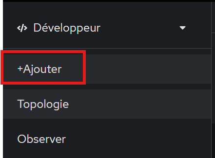
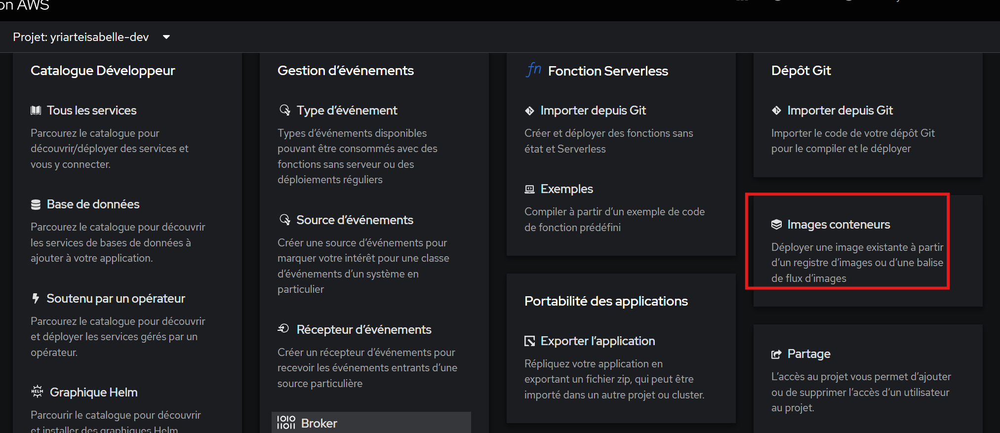

## Exercice 3 : Déploiement d'applications à partir d'images existantes

**Objectif** : Déployer des applications à partir d'images de conteneurs existantes.

**Durée** : 45 minutes

**Instructions** :

1. Déploiement via l'interface web
   - Dans votre projet "<votre-nom-dev>"
   - Cliquez sur "Add" puis "Container Image"
  
  
   - Utilisez l'image "registry.access.redhat.com/rhscl/nginx-114-rhel7"
   - Nommez l'application "nginx-web"
   - Choisissez 'Deployment' pour 'Type de ressource'
   - Laissez les autres paramètres par défaut
   - Cliquez sur "Create"

1. Déploiement via la ligne de commande
   - Basculez vers votre projet CLI (optionnel) :
     ```bash
     oc project <votre-nom-dev>
     ```
   - Déployez une application à partir d'une image :
     ```bash
     oc new-app --name=nginx-cli registry.access.redhat.com/rhscl/nginx-114-rhel7
     oc new-app --name=jenkins-cli jenkins-ephemeral
     ```
   - Exposez le service pour y accéder depuis l'extérieur :
     ```bash
     oc expose service/jenkins-cli
     ```

2. Exploration des ressources créées
   - Listez les déploiements :
     ```bash
     oc get deployments
     ```
   - Listez les déploiementconfigs :
     ```bash
     oc get deploymentconfig
     ```
   - Listez les pods :
     ```bash
     oc get pods
     ```
   - Listez les services :
     ```bash
     oc get services
     ```
   - Listez les routes :
     ```bash
     oc get routes
     ```

3. Accès à l'application
   - Récupérez l'URL de la route :
     ```bash
     oc get route jenkins-cli -o jsonpath='{.spec.host}'
     ```
   - Accédez à l'application dans votre navigateur

4. Supprimer les ressources
   - Récupérez l'URL de la route :
     ```bash
     oc delete all -l app=jenkins-cli
     ```

**Questions de réflexion** :
- Quelles ressources Kubernetes/OpenShift ont été créées lors du déploiement ?
- Comment OpenShift facilite-t-il le déploiement par rapport à Kubernetes natif ?
